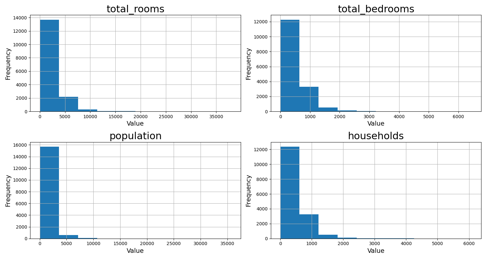
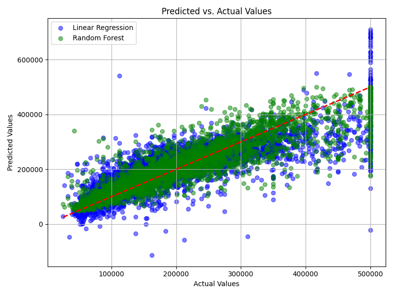

# California Housing Price Prediction

## Table of Contents
- [Project Overview](#project-overview)
- [Google Colab Notebook](#google-colab-notebook)
- [Statistical Tools](#statistical-tools)
- [Dataset Source](#dataset-source)
- [Dataset Description](#dataset-description)
- [Data Preprocessing and Exploration](#data-preprocessing-and-exploration)
- [Model Training](#model-training)
  - [Linear Regression](#linear-regression)
  - [Random Forest](#random-forest)
- [Hyperparameter Tuning](#hyperparameter-tuning)
- [Model Evaluation](#model-evaluation)
  - [Comparison of R^2, RMSE, and MAE Metrics](#comparison-of-r2-rmse-and-mae-metrics)
  - [Comparison of Predicted vs Actual Values](#comparison-of-predicted-vs-actual-values)
- [Feature Importance](#feature-importance)
- [Insights and Interpretations](#insights-and-interpretations)
  - [Key Findings from Model Predictions](#key-findings-from-model-predictions)
  - [Insights into Feature Relationships](#insights-into-feature-relationships)
  - [Practical Implications for Business](#practical-implications-for-business)
- [Detailed Project Summary](#detailed-project-summary)
  - [Summary of Goals](#summary-of-goals)
  - [Achievement of Objectives](#achievement-of-objectives)
- [Limitations](#limitations)
- [Future Steps](#future-steps)
- [Acknowledgements](#acknowledgements)
- [Project Conclusion](#project-conclusion)

## Project Overview
This project aimed to predict housing prices in California using machine learning techniques, utilizing the California Housing Prices dataset which contains information from the 1990 census. Although the dataset reflects historical data, it provided a valuable platform for applying and demonstrating various machine learning methodologies. The analysis involved several key steps:

1. **Data Exploration and Preprocessing**:
   - Investigated the dataset to understand feature distributions and relationships.
   - Performed data cleaning and preprocessing, including handling missing values, encoding categorical variables, and scaling features.

2. **Model Development and Evaluation**:
   - Developed a baseline Linear Regression model and evaluated its performance.
   - Trained a Random Forest model to enhance predictive accuracy and compared it against the linear model.

3. **Hyperparameter Tuning**:
   - Optimized the Random Forest model using hyperparameter tuning techniques such as RandomizedSearchCV to identify the best model parameters.

4. **Model Assessment**:
   - Assessed model performance using metrics such as R², RMSE, and MAE to determine the effectiveness of the models.
   - Analyzed feature importance to understand the key factors influencing housing prices.

5. **Visualization and Insights**:
   - Created visualizations to present the model results and feature importances clearly.
   - Provided insights based on the analysis to interpret the factors driving housing prices and suggested possible model improvements.

The goal of this project was to develop a robust predictive model for housing prices and derive actionable insights from the data. While the dataset represents historical housing conditions, the project demonstrated proficiency in data preprocessing, model building, and performance evaluation, providing a solid foundation for more complex real-world applications.

## Google Colab Notebook
[Link to the Google Colab Notebook](https://colab.research.google.com/drive/1tbZNVhZe6XgBUQ2yG6bQDv7QzqFRVDVa?usp=sharing)

This notebook contains the Python code used for the housing price prediction analysis in this project. It includes:

- Data preprocessing steps
- Feature engineering
- Model development and evaluation
- Implementation of both Linear Regression and Random Forest models
- Hyperparameter tuning and performance assessment
- Visualizations and insights related to predicting California housing prices based on 1990 data

The notebook provides a comprehensive overview of the analysis, helping to interpret historical trends and understand the factors influencing housing values during that period.


## Statistical Tools
For this housing price prediction project, I utilized the following tools and platforms:

- **Python**: Employed for data preprocessing, feature engineering, model development, evaluation, and creating visualizations.
- **Google Colab**: Used for its cloud-based Jupyter notebook environment, which facilitated efficient code execution and provided an accessible platform for potential collaboration.
- **Git and GitHub**: Leveraged for version control, enabling effective tracking of changes, managing project iterations, and sharing the work.
- **NumPy and Pandas**: Essential libraries for data manipulation and analysis, aiding in handling and preparing the dataset.
- **Matplotlib and Seaborn**: Utilized for creating visualizations that illustrate model performance, feature importance, and insights from the data.
- **Scikit-Learn**: Applied for splitting the dataset into training and test sets, implementing machine learning models, performing hyperparameter tuning, and evaluating model performance.

These tools and libraries were crucial for conducting a thorough analysis of housing prices, enabling effective data processing, modeling, and interpretation of results.

## Dataset Source
The dataset used in this project is the California Housing Prices dataset, sourced from [Kaggle](https://www.kaggle.com/datasets/camnugent/california-housing-prices). This dataset contains housing attributes from the 1990 California census and was employed to showcase proficiency in linear and nonlinear regression techniques.

## Dataset Description
**Dataset Overview:**
The California Housing Prices dataset includes housing attributes from the 1990 census, serving as a historical reference for analyzing factors that influence housing prices. Although it does not reflect current market conditions, it provides a practical dataset for demonstrating regression analysis skills.

**Features:**
The dataset contains the following features:
- `longitude`: A measure of how far west a house is; a higher value is farther west.
- `latitude`: A measure of how far north a house is; a higher value is farther north.
- `house_median_age`: Median age of a house within a block; a lower number is a newer building.
- `total_rooms`: Total number of rooms within a block.
- `total_bedrooms`: Total number of bedrooms within a block.
- `population`: Total number of people residing within a block.
- `households`: Total number of households, a group of people residing within a home unit, for a block.
- `median_income`: Median income for households within a block of houses (measured in tens of thousands of US Dollars).
- `median_house_value`: Median house value for households within a block (measured in US Dollars).
- `ocean_proximity`: Location of the house w.r.t ocean/sea.

**Feature Engineering and Preprocessing:**
- **One-Hot Encoding**: Categorical variable `ocean_proximity` was one-hot encoded into the following features:
  - `<1H OCEAN`
  - `INLAND`
  - `NEAR OCEAN`
  - `NEAR BAY`
  - `ISLAND`
- **Feature Engineering**:
  - `bedroom_ratio`: Ratio of total bedrooms to total rooms.
  - `rooms_per_household`: Ratio of total rooms to total households.
- **Log Transformations**: Applied to variables with skewed distributions (e.g., `total_rooms`, `total_bedrooms`, `population`, `households`).

**Target Variable:**
- `median_house_value`: The median house value for each block is the target variable for the regression analysis.

**Size and Format:**
- **Number of Observations**: 20,640
- **Number of Features**: 10
- **File Format**: CSV

**Usage:**
This dataset was employed to develop and evaluate predictive models for housing prices based on historical data from the 1990 California census. It helped in understanding how various features influenced housing values and demonstrated the application of regression techniques in a real-world context.

**Notes:**
- Missing values were addressed during preprocessing.
- The dataset was split into training and test sets for model evaluation.

## Data Preprocessing and Exploration
- **Initial Setup**:
Before diving into the analysis, it was essential to import the necessary libraries and load the dataset for processing and exploration.
  
  ```python
  #importing essential libraries
  import numpy as np
  import pandas as pd
  import matplotlib.pyplot as plt
  import seaborn as sns
  
  #loading the dataset
  data = pd.read_csv("housing.csv")
  ```

- **Handling Missing Values**:
Upon initial inspection of the dataset, it was found that the `total_bedrooms` column had missing values. Out of 20,640 entries, only 207 (approximately 1%) were missing. Since this accounts for less than 5% of the dataset, it was deemed acceptable to drop the rows with missing values.

  ```python
  #check for missing values
  data.info()
  
  #drop missing values
  data.dropna(inplace = True)
  ```

- **Splitting Data into Train and Test Sets**:
To evaluate the performance of predictive models effectively, the dataset was split into training and test sets. This approach allowed for training the models on one portion of the data and evaluating them on a separate, unseen portion to ensure the models generalized well to new data.
  ```python
  #split the data into test and train data and x and y data
  from sklearn.model_selection import train_test_split
  
  X = data.drop(['median_house_value'], axis = 1) #say axis =1 since we are dropping column
  y = data['median_house_value']
  
  X_train, X_test, y_train, y_test = train_test_split(X, y, test_size = 0.2) #80/20 split
  ```
- **Exploratory Data Analysis**:
Exploratory Data Analysis (EDA) is a crucial step in understanding the dataset and uncovering underlying patterns, trends, and relationships among the features. This process helps in formulating hypotheses and guiding further analysis. In this project, EDA involved several key steps:
  - **Combining Training Data**:
  To facilitate a thorough exploration of the training data, the target variable was recombined with the predictor variables. This combined dataset was used for various EDA techniques.
  ```python
  #combine to make the full train data
  train_data = X_train.join(y_train)
  ```
  - **Visualizing Distributions of Numerical Variables**:
  Plotted histograms for numerical variables to understand their distributions. Some variables appeared skewed and required later transformation.
  ```python
  #basic exploration of numeric variables (not ocean proximity)
  train_data.hist(figsize = (15,8))
  ```
  

  
  - **Correlation of Numerical Variables with Target Variable**:
   Calculated correlation coefficients and visualized the correlation heatmap to identify relationships between variables. Correlation coefficients measure the strength and direction of the linear relationship between two variables. They range from -1 to 1, where:
    - **1** indicates a perfect positive linear relationship,
    - **-1** indicates a perfect negative linear relationship,
    - **0** indicates no linear relationship.

    In this analysis, `median_income` emerged as the most positively correlated with `median_house_value`, with a correlation coefficient of 0.69. This suggests that the income level of the area plays a significant role in determining housing prices. Other notable correlations include `latitude`, which had a negative correlation of -0.14, indicating that houses located further north tend to have lower values, and `total_rooms`, which showed a positive correlation of 0.14, suggesting that more rooms are associated with higher house values.
    The heatmap below highlights the target variable, `median_house_value`, in red for easy identification. This visual emphasis helps in quickly identifying the strength of correlations between `median_house_value` and other variables. Note that the target variable will be consistently highlighted in red in subsequent heatmaps for uniformity and ease of comparison.

  ```python
  #select only numerical columns
  numerical_train_data = train_data.select_dtypes(include=np.number)
  
  #calculate the correlation matrix
  correlation_matrix = numerical_train_data.corr()
  
  #create the heatmap
  plt.figure(figsize=(15, 8))
  heatmap = sns.heatmap(correlation_matrix, annot=True, cmap="YlGnBu",
  cbar_kws={'label': 'Correlation Coefficient'})
  
  #customize the x and y axis tick labels
  #this makes median_house_value show in red
  for tick_label in heatmap.get_xticklabels():
      if tick_label.get_text() == 'median_house_value':
          tick_label.set_color('red')
  
  for tick_label in heatmap.get_yticklabels():
      if tick_label.get_text() == 'median_house_value':
          tick_label.set_color('red')
  
  plt.tight_layout()
  plt.show()
  ```
  

  - **Log Transformation of Variables**:
  Applied log transformations to several numerical variables to address right-skewed distributions. Log transformations are often used to normalize skewed data, making it more suitable for modeling. Adding 1 to the values before transformation avoids taking the logarithm of zero, which is undefined.

  ```python
  #four columns that will need to be log transformed later
  columns_to_plot = ['total_rooms', 'total_bedrooms', 'population', 'households']
  
  #plot histograms for the specified columns
  axes = train_data[columns_to_plot].hist(figsize=(15, 8))
  
  #set title and label sizes
  for ax in axes.flatten():
      ax.title.set_fontsize(22) 
      ax.set_xlabel('Value', fontsize=14) 
      ax.set_ylabel('Frequency', fontsize=14) 
  
  plt.tight_layout()
  plt.show()
  
  #many hists are right-skewed (take log)
  train_data['total_rooms'] = np.log(train_data['total_rooms'] +1) #+1 to avoid zero values
  train_data['total_bedrooms'] = np.log(train_data['total_bedrooms'] +1)
  train_data['population'] = np.log(train_data['population'] +1)
  train_data['households'] = np.log(train_data['households'] +1)

  #the log transformed variables look more normal now
  #the four transformed columns
  columns_to_plot = ['total_rooms', 'total_bedrooms', 'population', 'households']
  
  #plot histograms for the specified columns after transformation
  axes = train_data[columns_to_plot].hist(figsize=(15, 8))
  
  #set title and label sizes
  for ax in axes.flatten():
      ax.title.set_fontsize(22) 
      ax.set_xlabel('Value', fontsize=14) 
      ax.set_ylabel('Frequency', fontsize=14) 
  
  plt.tight_layout()
  plt.show()
  ```
    Displayed below are the histograms of the original variables:
  
    The original histograms for `total_rooms`, `total_bedrooms`, `population`, and `households` show that these variables were all heavily right-skewed. Right-skewed distributions can negatively impact the performance of statistical and machine learning models by violating assumptions of normality and homoscedasticity.

    After applying log transformations to these variables, their histograms displayed more normalized distributions, as shown below:
  
    These transformations helped to reduce skewness, resulting in distributions that are closer to normal. This normalization is crucial as it can improve the performance and reliability of the models by ensuring that the data meets the assumptions required for many statistical and machine learning techniques.
  
  - **Visualizing Distribution of Categorical Variable**:
  Visualized the distribution of the `ocean_proximity` categorical variable to understand the frequency of each category. The category `ISLAND` has a very low count (only 4 occurrences), making it virtually invisible in the bar graph. In contrast, the other categories have significantly higher counts, with the highest category `<1H OCEAN` reaching 7,261 occurrences.
  ```python
  #checked the distribution of categories
  train_data['ocean_proximity'].value_counts().plot(kind='bar')
  plt.xlabel('Ocean Proximity')
  plt.ylabel('Count')
  plt.title('Distribution of Ocean Proximity')
  plt.tight_layout()
  plt.show()

  #check how many counts island has since not visible in visual
  train_data['ocean_proximity'].value_counts() #island has 4 counts
  ```
  
  
  - **Applying One-Hot Encoding**:
  Applied one-hot encoding to the `ocean_proximity` variable to convert it into a format suitable for machine learning models. This process includes creating binary columns for each category.
  ```python
  #one hot encoding
  dummies = pd.get_dummies(train_data.ocean_proximity)
  #convert the boolean values to integers (0 and 1)
  dummies = dummies.astype(int)

  #make sure it worked
  print(dummies)

  #add new columns
  #no longer need ocean_proximity
  train_data = train_data.join(dummies).drop('ocean_proximity', axis = 1)
  ```
  
  - **Correlation Heatmap with One-Hot Encoded Variables**:
  A new heatmap was generated to visualize the correlations between variables after applying one-hot encoding. The heatmap revealed that the `ocean_proximity` categories `<1H OCEAN` and `INLAND` had the strongest correlations with `median_house_value`, with coefficients of 0.26 and -0.48, respectively. This indicates that a house’s proximity to the ocean has a significant influence on its value, with houses closer to the ocean tending to have higher values, while inland houses tend to have lower values.
  ```python
  #create the heatmap
  plt.figure(figsize=(15, 8))
  heatmap = sns.heatmap(train_data.corr(), annot=True, cmap="YlGnBu",
  cbar_kws={'label': 'Correlation Coefficient'})
  
  #customize the x and y axis tick labels
  #this makes median_house_value label red again
  for tick_label in heatmap.get_xticklabels():
      if tick_label.get_text() == 'median_house_value':
          tick_label.set_color('red')
  
  for tick_label in heatmap.get_yticklabels():
      if tick_label.get_text() == 'median_house_value':
          tick_label.set_color('red')
  
  plt.tight_layout()
  plt.show()
  ```
  
  
  - **Visualization of Coordinates**:
  To investigate how geographical location influences house prices, a scatter plot of `latitude` versus `longitude` was created. This visualization aimed to identify any spatial patterns related to `median_house_value`. The scatter plot showed that higher house values (indicated by red) were concentrated along the coast, while lower house values (indicated by blue) were more frequently observed inland. This pattern corroborates the earlier findings from the correlation heatmap, highlighting the impact of geographical proximity to the coast on house prices.
  ```python
  #visualization of the coordinates
  plt.figure(figsize = (12,8))
  sns.scatterplot(x = 'latitude', y = 'longitude', data = train_data,
                  hue = 'median_house_value', palette='coolwarm')
  #set the x and y labels and title font size
  plt.xlabel('Latitude', fontsize=16)
  plt.ylabel('Longitude', fontsize=16)
  plt.title('Latitude vs. Longitude with Median House Value', fontsize=20)
  
  plt.tight_layout()
  plt.show()
  #red is touching the coast (more expensive)
  #blue housing is more inland (less expensive)
  ```
  
  
  - **Feature Engineering**:
  New features were created to provide additional insights into the data. Specifically, the `bedroom_ratio` was calculated as the ratio of `total_bedrooms` to `total_rooms`, and `rooms_per_household` was derived as the ratio of `total_rooms` to the number of `households`.  These additional features were intended to provide more insightful information that could improve model performance.
  ```python
  #create two new columns
  train_data['bedroom_ratio'] = train_data['total_bedrooms'] / train_data['total_rooms']
  train_data['rooms_per_household'] = train_data['total_rooms'] / train_data['households']
  ```
  
  - **Correlation Heatmap with Engineered Features**:
   A new heatmap was created to visualize the correlations between the newly engineered features and the target variable. The updated correlations indicated that while some original features had relatively weak relationships with the target variable, the engineered features exhibited more significant correlations. Specifically:
    - `total_rooms` showed a correlation of 0.16 with median_house_value.
    - `total_bedrooms` had a correlation of 0.054.
    - `bedroom_ratio` had a correlation of -0.20, suggesting that houses with a higher proportion of bedrooms relative to total rooms, possibly due to conversions of other spaces into bedrooms, might influence home values.
    - `households` showed a correlation of 0.073.
    - `rooms_per_household` had a correlation of 0.12.
      
    These observations suggest that the engineered features, particularly `bedroom_ratio`, might better capture aspects of the housing data that affect values, such as the impact of converted rooms or garages on home prices.

  ```python
  #third and final heatmap with log transformed, one hot encoded, and engineered features
  #create the heatmap
  plt.figure(figsize=(15, 8))
  heatmap = sns.heatmap(train_data.corr(), annot=True, cmap="YlGnBu", cbar_kws={'label': 'Correlation Coefficient'})
  
  #customize the x and y axis tick labels
  #this makes median_house_value label red again
  for tick_label in heatmap.get_xticklabels():
      if tick_label.get_text() == 'median_house_value':
          tick_label.set_color('red')
  
  for tick_label in heatmap.get_yticklabels():
      if tick_label.get_text() == 'median_house_value':
          tick_label.set_color('red')
  
  plt.tight_layout()
  plt.show()
  ```
  
  
  - **Scaling Data**:
  To ensure that all features contributed equally to the model training, data scaling was performed. Scaling standardizes the range of the features, which is particularly important for algorithms that are sensitive to feature magnitudes.

    Since new features were added during previous steps, the dataset was re-split into feature variables (X_train) and the target variable (y_train). The StandardScaler was then applied to standardize the features in the training data. This process transforms the features so they have a mean of 0 and a standard deviation of 1, which helps in improving the performance and convergence of many machine learning algorithms.

  ```python
  from sklearn.preprocessing import StandardScaler
  scaler = StandardScaler()
  
  #we don't have to do the train test split again, but since we added more features
  #we have to do the x y split again
  X_train, y_train = train_data.drop('median_house_value', axis = 1),
  train_data['median_house_value']
  #scale the train data
  X_train_s = scaler.fit_transform(X_train)
  ```
  
  - **Applying Preprocessing to Test Data**
  To maintain consistency, the same preprocessing steps were applied to the test data. This included joining X_test and y_test, applying log transformations, one-hot encoding the `ocean_proximity` column, adding the engineered features, and scaling the data.

  ```python
  #join the data into a data frame
  test_data = X_test.join(y_test)

  #log transform the same variables as we did for train
  test_data['total_rooms'] = np.log(test_data['total_rooms'] +1) #to avoid zero values
  test_data['total_bedrooms'] = np.log(test_data['total_bedrooms'] +1)
  test_data['population'] = np.log(test_data['population'] +1)
  test_data['households'] = np.log(test_data['households'] +1)

  #one-hot encode the same variable as we did for train
  test_dummies = pd.get_dummies(test_data.ocean_proximity)
  #convert the boolean values to integers (0 and 1)
  test_dummies = test_dummies.astype(int)
  test_data = test_data.join(test_dummies).drop('ocean_proximity', axis = 1)

  #perform the same feature engineering as we did for train
  test_data['bedroom_ratio'] = test_data['total_bedrooms'] / test_data['total_rooms']
  test_data['rooms_per_household'] = test_data['total_rooms'] / test_data['households']

  #split back into x and y
  X_test, y_test = test_data.drop('median_house_value', axis = 1),
  test_data['median_house_value']

  #scale the test data
  X_test_s = scaler.transform(X_test)
  ```

## Model Training
### Linear Regression
- Implemented and evaluated a Linear Regression model to establish a baseline performance for predicting house prices. This model helped to understand the linear relationships between the features and the target variable.
  
  ```python
  #start linear model
  from sklearn.linear_model import LinearRegression

  reg = LinearRegression()

  reg.fit(X_train_s, y_train)

  #check the R^2
  reg.score(X_test_s, y_test)

  #use these later to compare with other models
  from sklearn.metrics import mean_squared_error, mean_absolute_error, r2_score
  #predictions and evaluation for Linear Regression
  y_pred_lr = reg.predict(X_test_s)
  r2_lr = r2_score(y_test, y_pred_lr)
  rmse_lr = np.sqrt(mean_squared_error(y_test, y_pred_lr))
  mae_lr = mean_absolute_error(y_test, y_pred_lr)
  ```

### Random Forest
- Implemented and evaluated a base Random Forest model with default parameters to capture non-linear relationships and interactions between features, providing a comparison with the baseline Linear Regression model.
  
  ```python
  #initial random forest with default parameters
  from sklearn.ensemble import RandomForestRegressor

  forest = RandomForestRegressor()
  forest.fit(X_train_s, y_train)

  #check R^2 to get an idea of fit
  forest.score(X_test_s, y_test)
  
  #predictions and evaluation for base Random Forest
  y_pred_rf_base = forest.predict(X_test_s)
  r2_rf_base = r2_score(y_test, y_pred_rf_base)
  rmse_rf_base = np.sqrt(mean_squared_error(y_test, y_pred_rf_base))
  mae_rf_base = mean_absolute_error(y_test, y_pred_rf_base)
  ```

## Hyperparameter Tuning
- To improve the Random Forest model's performance, RandomizedSearchCV was used to find the optimal hyperparameters. Initially, GridSearchCV was attempted, but it was too time-consuming. Therefore, a smaller subset of the training data was created to expedite the RandomizedSearchCV process. After trying various configurations, a suitable setup for RandomizedSearchCV was found that completed in approximately 10 minutes. The best parameters from the RandomizedSearchCV were then used to retrain the model on the full training dataset.
  
  ```python
  #decided to hypertune on a smaller subset of training data
  #print the shape of X_train and y_train
  print("Number of samples in X_train:", X_train.shape[0])
  print("Number of samples in y_train:", y_train.shape[0])
  
  #random 5000 subset
  #further split the training set to create a smaller subset for faster computation
  #using underscores to ignore the remaining parts of the split
  X_train_small, _, y_train_small, _ = train_test_split(X_train_s, y_train, train_size=5000,
  random_state=42, shuffle=True)
  
  #print the shape of the smaller subset to confirm
  print("Number of samples in X_train_small:", X_train_small.shape[0])
  print("Number of samples in y_train_small:", y_train_small.shape[0])

  import time
  from sklearn.model_selection import RandomizedSearchCV
  from scipy.stats import randint
  
  #define the parameter distributions
  param_dist = {
      'n_estimators': randint(100, 500), 
      'max_depth': randint(10, 30),      
      'min_samples_split': randint(2, 10),
      'min_samples_leaf': randint(1, 5)
  }
  
  #initialize the model
  forest = RandomForestRegressor(random_state=42)
  
  #set up RandomizedSearchCV
  n_iter_search = 30  #adjust as needed
  random_search = RandomizedSearchCV(estimator=forest, param_distributions=param_dist,
  n_iter=n_iter_search, cv=3, scoring='r2', n_jobs=-1, verbose=2, random_state=42)
  
  #start timing
  start_time = time.time()

  #fit the RandomizedSearchCV to the reduced training data
  random_search.fit(X_train_small, y_train_small)
  
  #end timing
  end_time = time.time()
  
  #calculate the time taken
  total_time = end_time - start_time
  print(f"Total time for RandomizedSearchCV with 30 iterations: {total_time / 60:.2f} minutes")
  
  #print the best parameters and best score
  print("Best parameters found with RandomizedSearchCV: ", random_search.best_params_)
  print("Best cross-validation score with RandomizedSearchCV (R^2): ",
  random_search.best_score_)

  #retrain the model on the full dataset with the best parameters
  best_forest = random_search.best_estimator_
  best_forest.fit(X_train_s, y_train)
  score = best_forest.score(X_test_s, y_test)
  print(f"R^2 score on test data: {score}")

  #predictions and evaluation for the tuned Random Forest
  y_pred_rf_tuned = best_forest.predict(X_test_s)
  r2_rf_tuned = r2_score(y_test, y_pred_rf_tuned)
  rmse_rf_tuned = np.sqrt(mean_squared_error(y_test, y_pred_rf_tuned))
  mae_rf_tuned = mean_absolute_error(y_test, y_pred_rf_tuned)
  ```

## Model Evaluation
This section compares the performance of different models using various evaluation metrics and visualizations. The goal was to identify which model would provide the best predictive accuracy for the housing price data. 

### Comparison of R^2, RMSE, and MAE Metrics
The models were evaluated by comparing the R-squared (R^2), Root Mean Squared Error (RMSE), and Mean Absolute Error (MAE) metrics. These metrics provide insights into how well each model fits the data and predicts the housing prices.

  ```python
  #create a DataFrame to display the results
  results = pd.DataFrame({
      'Model': ['Linear Regression', 'Base Random Forest', 'Tuned Random Forest'],
      'R^2': [r2_lr, r2_rf_base, r2_rf_tuned],
      'RMSE': [rmse_lr, rmse_rf_base, rmse_rf_tuned],
      'MAE': [mae_lr, mae_rf_base, mae_rf_tuned]
  })
  
  print(results)
  ```
| Model               | R^2     | RMSE         | MAE          |
|---------------------|---------|--------------|--------------|
| Linear Regression   | 0.655032 | 67787.206688 | 48528.442689 |
| Base Random Forest  | 0.806115 | 50819.506353 | 32871.983496 |
| Tuned Random Forest | 0.810007 | 50306.886923 | 32503.304391 |


Based on these metrics, the Tuned Random Forest model is the best performer. It has the highest R^2 value, indicating the best fit to the data. Additionally, it has the lowest RMSE and MAE values, showing that it makes the most accurate predictions on average and has the smallest average prediction error. Therefore, the Tuned Random Forest model is the most accurate and reliable model for predicting housing prices in this dataset.

### Comparison of Predicted vs Actual Values
This section visualizes the predicted values against the actual values for both the Linear Regression and the Tuned Random Forest models. The goal was to assess how well each model's predictions matched the true house prices.

A scatter plot is used to compare the predictions from the Linear Regression model and the Tuned Random Forest model. In this plot, each point represents a single house, with its position determined by the actual price and the predicted price from the respective model. The red dashed line represents the line of perfect prediction, where the predicted values perfectly match the actual values.

  ```python
  # Predictions
  y_pred_linear = reg.predict(X_test_s)
  y_pred_forest = best_forest.predict(X_test_s)
  
  #scatter plot for linear regression
  plt.figure(figsize=(8, 6))
  plt.scatter(y_test, y_pred_linear, color='blue', alpha=0.5, label='Linear Regression')
  
  #scatter plot for random forest
  plt.scatter(y_test, y_pred_forest, color='green', alpha=0.5, label='Random Forest')
  
  #plotting the diagonal line
  plt.plot([y_test.min(), y_test.max()], [y_test.min(), y_test.max()], color='red',
  linestyle='--', linewidth=2)
  
  plt.title('Predicted vs. Actual Values')
  plt.xlabel('Actual Values')
  plt.ylabel('Predicted Values')
  plt.legend()
  plt.grid(True)
  plt.tight_layout()
  plt.show()
  ```
  
  
In the scatter plot, the Random Forest model (green dots) is noticeably tighter around the red dotted line, indicating a better fit compared to the Linear Regression model (blue dots). The Linear Regression model had some negative predicted values, reflecting a poor fit and potential issues with the model's assumptions. Both models struggled to provide accurate predictions for values close to $500,000, but the Random Forest model performed better in this range, demonstrating its robustness and improved prediction accuracy.

## Feature Importance
An analysis of feature importance was conducted using the Tuned Random Forest model to understand which features most significantly impacted the model’s predictions.

Key findings include:
- `median_income`: The most important feature, with an importance score of 0.49.
- `INLAND`: The second most influential feature, with an importance score of 0.14.
- `longitude` and `latitude`: Contributed with importance scores of 0.09 and 0.08, respectively.
- `house_median_age`: Had a smaller yet significant importance score of 0.05.
- Remaining features: Exhibited progressively smaller importance scores, indicating minimal impact on the model’s predictions.

Overall, it was observed that **income**, **geographical location**, and **housing age** were the most influential factors affecting the model's predictions.

  ```python
  #access feature importances
  importances = best_forest.feature_importances_
  
  #match importances to features
  feature_names = X_train.columns  #used X_train because X_train_s gave me issues
  feature_importances = pd.Series(importances, index=feature_names)
  
  #sort and visualize
  sorted_importances = feature_importances.sort_values(ascending=False)
  
  plt.figure(figsize=(10, 6))
  sorted_importances.plot(kind='barh', color='#4682B4')
  plt.title('Feature Importances - Random Forest')
  plt.xlabel('Importance')
  plt.ylabel('Feature')
  plt.gca().invert_yaxis() #reverse y-axis order to have most important at top
  plt.tight_layout()
  plt.show()

  #code to get the actual importance numbers
  #sort and display the top features with their importance scores
  sorted_importances = feature_importances.sort_values(ascending=False)
  print(sorted_importances)
  ```
  

## Insights and Interpretations

### Key Findings from Model Predictions

- **Model Performance**: The Tuned Random Forest model outperformed the Linear Regression model in terms of R², RMSE, and MAE. The R² score of the Tuned Random Forest was approximately 0.81, indicating a better fit to the data compared to Linear Regression, which had an R² score of 0.66. This suggests that the Random Forest model more effectively captured the complexities and interactions in the data.
- **Prediction Accuracy**: Both models struggled with accurate predictions for home values around $500,000, but the Tuned Random Forest model provided more reliable estimates in this range compared to the Linear Regression model. The Random Forest model demonstrated its robustness in handling diverse data patterns and outliers.

### Insights into Feature Relationships

- **Median Income**: The analysis revealed that `median_income` was the most influential feature, with an importance score of 0.49. This indicates that income levels are a strong predictor of house prices, highlighting the economic significance of income in determining property values.
- **Geographical Factors**: Features related to location, such as `INLAND`, `longitude`, and `latitude`, played a substantial role in predicting house prices. The `INLAND` feature, with an importance score of 0.14, suggests that proximity to the coast has a notable impact on home values. Houses closer to the coast tend to have higher values, reflecting the desirability of coastal locations.
- **Housing Age**: `housing_median_age` had a smaller yet significant impact with an importance score of 0.05. This indicates that the age of a property can influence its value, though to a lesser extent compared to income and location.
- **Feature Engineering Impact**: The addition of engineered features, such as `bedroom_ratio` and `rooms_per_household`, provided more granular insights into how room distribution and household size affect house prices. For example, `bedroom_ratio` can capture the effect of room or garage conversions on home values, adding another layer of understanding to property pricing.

### Practical Implications for Business

- **Income-Based Pricing Strategies**: Businesses and real estate professionals can use insights from `median_income` to tailor pricing strategies and target markets more effectively. Areas with higher median incomes are likely to have higher property values, influencing investment and pricing decisions.
- **Geographic Targeting**: The importance of location-based features underscores the need for geographic targeting in marketing and property development. Coastal properties or areas with desirable geographical attributes can be leveraged to attract premium buyers.
- **Property Age Considerations**: Understanding the impact of property age on value can guide renovation and investment strategies. Older properties may require more investment to reach competitive pricing levels compared to newer homes.

## Detailed Project Summary

### Summary of Goals

At the outset of the project, the primary goals were to:
1. Perform comprehensive data exploration and preprocessing to prepare the dataset for modeling.
2. Develop a predictive model for housing prices in California using machine learning techniques.
3. Compare the performance of different models, including Linear Regression and Random Forest, and optimize model performance through hyperparameter tuning.
4. Assess model performance using key metrics and analyze feature importance to understand the factors influencing housing prices.
5. Provide clear visualizations and actionable insights based on the analysis to aid decision-making.

### Achievement of Objectives

1. **Data Exploration and Preprocessing**:
   - Conducted thorough data exploration to understand feature distributions and relationships. Applied necessary preprocessing steps such as handling missing values, encoding categorical variables, and scaling features to ensure the data was in optimal shape for modeling.

2. **Predictive Modeling**:
   - Successfully developed and evaluated a baseline Linear Regression model and a Random Forest model. The Random Forest model, particularly after hyperparameter tuning, demonstrated superior predictive accuracy compared to the Linear Regression model.

3. **Model Comparison and Hyperparameter Tuning**:
   - Compared the performance of Linear Regression and Random Forest models, finding the Random Forest model to be more accurate. Used RandomizedSearchCV to optimize the Random Forest model's parameters, resulting in improved performance metrics.

4. **Model Assessment**:
   - Evaluated model performance using R², RMSE, and MAE metrics. The Random Forest model achieved the highest R² score and the lowest RMSE and MAE, indicating better performance. Analyzed feature importance to identify key factors influencing housing prices, with `median_income`, `INLAND`, and geographical features emerging as the most significant predictors.

5. **Visualization and Insights**:
   - Created visualizations such as scatter plots and feature importance charts to clearly present model results. Derived insights on how key features like median income, location, and housing age impact housing prices, providing actionable information for data scientists and decision-makers.

The project met its objectives by demonstrating the effectiveness of machine learning techniques in predicting housing prices and delivering valuable insights for understanding the driving factors behind housing prices.

## Limitations

- **Dataset Limitations**: The dataset reflects historical housing conditions from the 1990s, which may not accurately represent current market trends and conditions. This historical perspective limits the model's applicability to present-day housing prices.

- **Feature Selection**: Feature selection was not performed before model training. The inclusion of irrelevant or redundant features could have impacted model performance and the overall accuracy of the predictions.

- **Outlier Management**: The analysis did not include outlier reduction or imputation. Outliers can significantly impact model performance, and addressing them might have improved the robustness and accuracy of the models. Handling outliers through techniques such as removal or transformation could have provided a more accurate representation of the data.

- **Data Transformation**: The analysis included log transformations on four variables, but other variables were not transformed. Additional transformations could have been beneficial. For instance, `longitude` and `latitude` exhibited bimodal distributions, and applying appropriate transformations to these variables might have improved model performance by addressing non-normal distributions and feature scales.

- **Preprocessing Functions**: Preprocessing steps applied to the training data were manually repeated for the test data. This approach is time-consuming and could lead to inconsistencies. Turning these steps into reusable functions would enhance efficiency and reproducibility.

- **Model Assumptions**: The assumptions of Linear Regression, including linearity, independence, and homoscedasticity, may not have been fully met. This could affect the validity and reliability of the Linear Regression model.

- **Computational Constraints**: RandomizedSearchCV was executed with a subset of the training data to manage computational constraints. A more extensive search with the full dataset might have yielded different results and potentially improved the model’s performance.

## Future Steps

- **Feature Engineering and Selection**: Explore additional feature engineering techniques to create new features that could enhance model performance. Conduct feature selection to identify and retain the most relevant variables, potentially improving model accuracy and reducing complexity.

- **Outlier Analysis and Handling**: Implement methods to detect, analyze, and manage outliers. This could involve using statistical techniques or visualizations to better understand and address the impact of outliers on model performance.

- **Data Transformation**: Extend preprocessing by applying appropriate transformations to variables with non-normal or bimodal distributions. For instance, log transformations were applied to some features, but other variables, such as `longitude` and `latitude`, which exhibited bimodal distributions, might have benefited from further transformations or advanced techniques like Box-Cox or power transformations.

- **Reusable Preprocessing Functions**: Develop reusable functions for preprocessing steps to ensure consistency and efficiency. Automating these steps will help manage data preparation more effectively and reduce the risk of errors when applying transformations to new data.

- **Model Comparison and Ensemble Methods**: Evaluate additional machine learning models and ensemble methods, such as Gradient Boosting or XGBoost, to compare their performance with the current models. Combining models using ensemble techniques could lead to more robust predictions.

- **Real-Time Data Integration**: Consider incorporating real-time data or more recent datasets to ensure the model remains relevant and accurate for current housing market conditions. This would involve continuous updating and retraining of the model with new data.

- **Hyperparameter Optimization Enhancements**: Experiment with advanced hyperparameter optimization techniques, such as Bayesian optimization, to potentially achieve better model performance and efficiency compared to RandomizedSearchCV.

## Acknowledgements

I would like to express my gratitude to the NeuralNine Youtube Channel for their invaluable [tutorial](https://www.youtube.com/watch?v=Wqmtf9SA_kk), which provided the initial inspiration for analyzing the California Housing Prices dataset. While the tutorial helped me get started and offered foundational insights into Random Forest modeling, I conducted the analysis and implemented the models independently, tailoring the techniques to fit the specific needs of this project. NeuralNine's comprehensive and insightful content greatly contributed to the success of this analysis.

## Project Conclusion

This project aimed to predict housing prices in California using machine learning models on historical data from the 1990 census. Through data exploration, model development, hyperparameter tuning, and visualization, the analysis revealed that the Tuned Random Forest model outperformed both the Linear Regression and base Random Forest models. Significant insights were gained into the importance of features such as median income, geographical location, and housing age in predicting housing prices. While the project successfully developed an accurate predictive model, it also identified several areas for future improvement, including feature selection, advanced data transformation, and handling outliers. Overall, the project showcased the application of machine learning techniques in real estate price prediction and provided a foundation for further refinement and enhancement.


